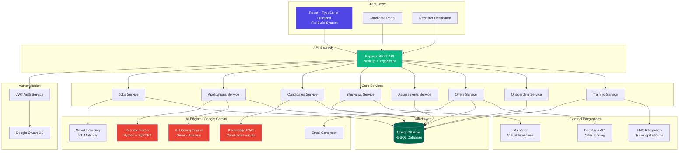
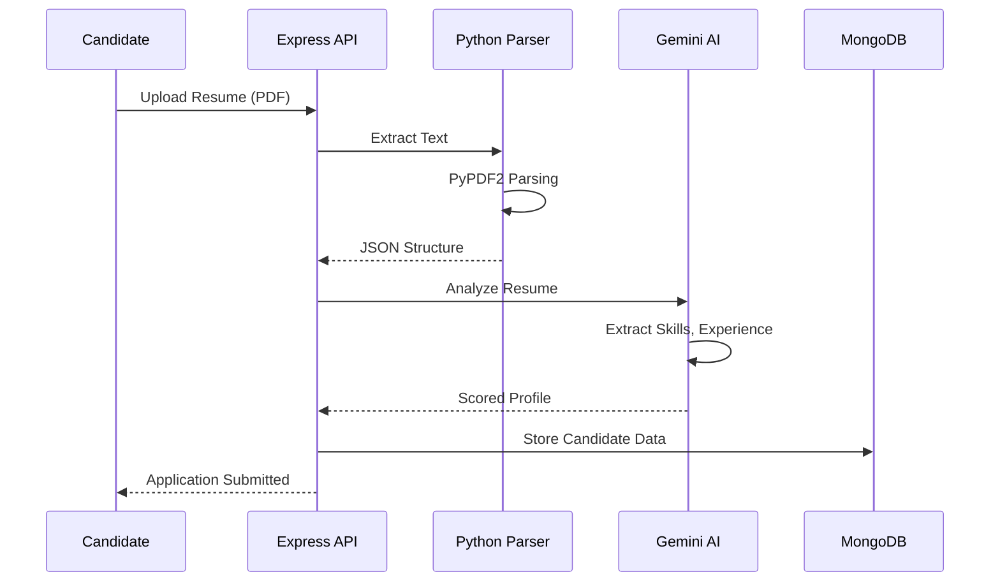
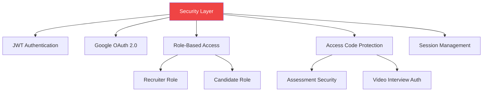
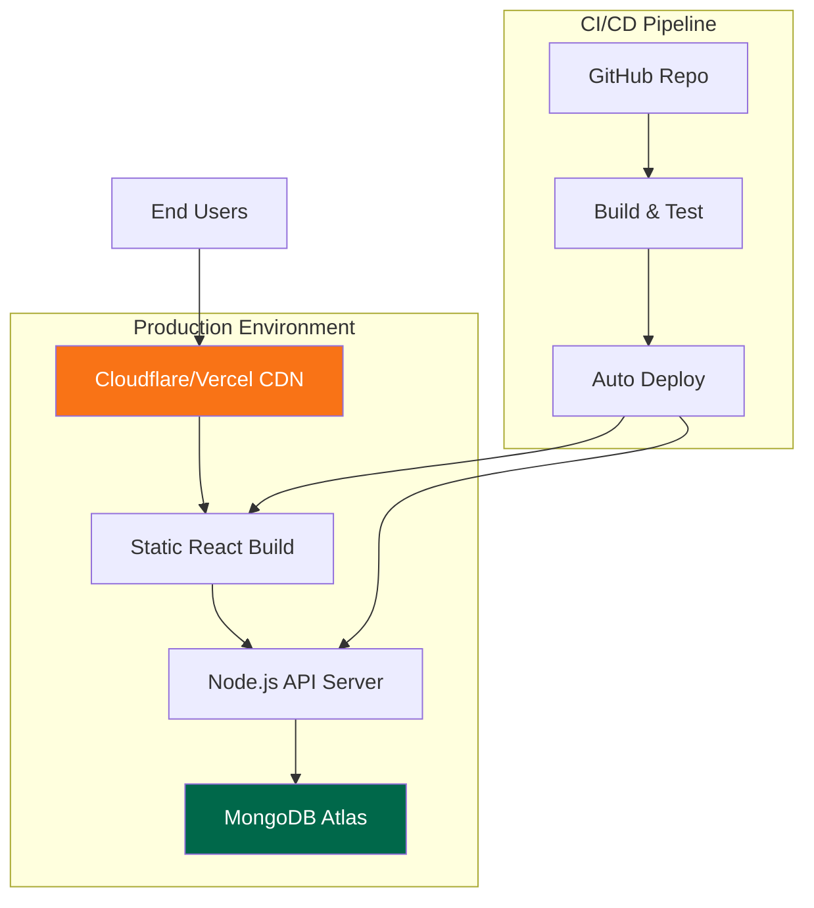

# HireSphere - System Architecture

## High-Level Architecture

---

## Three-Phase Hiring Pipeline

```mermaid
graph LR
    subgraph "PHASE 1: TALENT DISCOVERY"
        JOB[Post Job] --> AI_GEN[AI Job Generation]
        AI_GEN --> SMART_SRC[Smart Sourcing]
        SMART_SRC --> APPLY[Candidate Apply]
        APPLY --> PARSE[Resume Parser]
        PARSE --> SCORE[AI Scoring]
    end

    subgraph "PHASE 2: EVALUATION"
        SCORE --> SCREEN[Skill Assessments]
        SCREEN --> INTERVIEW[Virtual Interviews]
        INTERVIEW --> EVAL[Evaluation Hub]
        EVAL --> OFFER_GEN[Offer Management]
    end

    subgraph "PHASE 3: READINESS"
        OFFER_GEN --> SIGN[Digital Signing]
        SIGN --> ONBOARD[Onboarding]
        ONBOARD --> IT_PROV[IT Provisioning]
        IT_PROV --> TRAINING[Learning Readiness]
    end

    style JOB fill:#3B82F6,color:#fff
    style SCREEN fill:#8B5CF6,color:#fff
    style ONBOARD fill:#10B981,color:#fff
```

---

## AI Resume Processing Flow

---

## Technology Stack

### Frontend
- **Framework**: React 18 + TypeScript
- **Build Tool**: Vite
- **UI Library**: Shadcn UI + Tailwind CSS
- **Routing**: Wouter
- **Charts**: Recharts
- **State**: React Hooks

### Backend
- **Runtime**: Node.js 20+
- **Framework**: Express + TypeScript
- **Authentication**: JWT + Google OAuth
- **File Processing**: Multer
- **PDF Parsing**: Python (PyPDF2)

### Database
- **Primary**: MongoDB with Mongoose ODM
- **Models**: 15+ schemas (User, Job, Application, Interview, etc.)

### AI & ML
- **Engine**: Google Gemini 2.0 Flash
- **Features**:
  - Resume parsing & extraction
  - Candidate scoring & ranking
  - RAG-based knowledge retrieval
  - Smart job matching
  - Email generation

### Integrations
- **Video**: Jitsi Meet
- **Signatures**: DocuSign API
- **LMS**: Custom integrations
- **OAuth**: Google Identity Platform

---

## Data Models (15 Collections)

| Collection | Purpose |
|------------|---------|
| **users** | Recruiters & candidates with auth |
| **jobs** | Job postings & requirements |
| **applications** | Candidate applications with status |
| **candidates** | Parsed candidate profiles |
| **interviews** | Interview schedules & recordings |
| **assessments** | Skill test assignments |
| **testResults** | Assessment submissions & scores |
| **offers** | Offer letters & negotiations |
| **accessCodes** | Secure assessment codes |
| **onboardingTasks** | Checklist for new hires |
| **learningModules** | Training courses |
| **newHireTraining** | Employee training progress |
| **lmsIntegrations** | LMS platform configs |
| **aiInteractionLog** | AI usage analytics |

---

## Security Features

---

## Deployment Architecture

---

## Key Features by Phase

### 📊 Phase 1: Talent Discovery
- AI-powered job description generation
- Smart candidate sourcing
- Automated resume parsing (Python + Gemini)
- AI scoring & ranking (0-100 scale)
- Candidate portal with job search

### 🎯 Phase 2: Evaluation  
- Skill assessments with secure access codes
- Question bank management
- Virtual interviews via Jitsi
- Evaluation hub for candidate review
- Interview scheduler with calendar
- Offer management & analytics

### 🚀 Phase 3: Readiness
- Digital offer signing (DocuSign)
- Automated onboarding workflows
- IT provisioning checklists
- Learning management system
- Training progress tracking
- Analytics dashboard

---

## Performance Metrics

- **Resume Parsing**: ~2-3 seconds per PDF
- **AI Scoring**: ~1-2 seconds per candidate
- **Database Queries**: <100ms average
- **Frontend Load**: <2 seconds initial
- **Concurrent Users**: Scalable to 1000+
